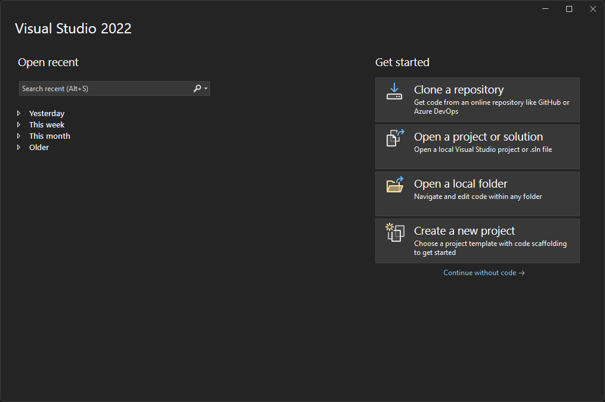
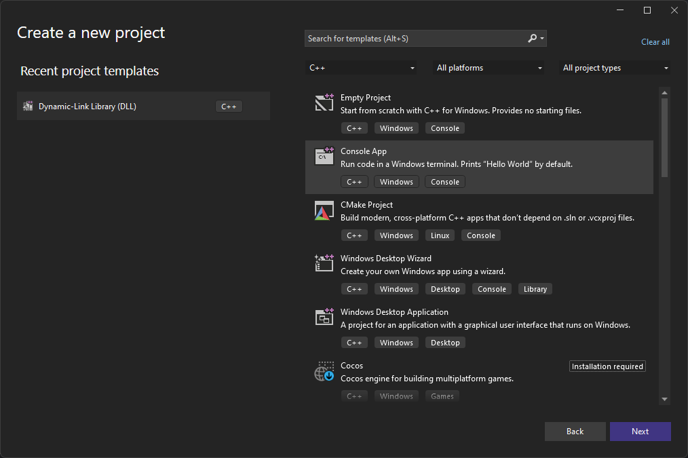

# Creating a Project

When you first open visual studio you will be greeted by a screen that looks like this:

To create a new project, click on the "Create a new project" button. This will open the project creation wizard.

Next you want to click the all languages tab, and then select C++.

Now in this guide we will be using the C++ Console App template, as it is the most basic template for a c++ project. But you can use any template you want for your project.

Now you want to give your project a name, and then click the create button. (Dont worry about the place solution and create directory for solution options, as they are not important for this guide)

## Done

Now you have created your first project in visual studio. You can now start writing code for your project.

---