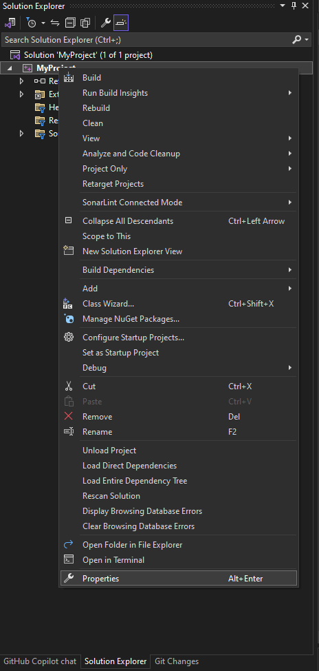
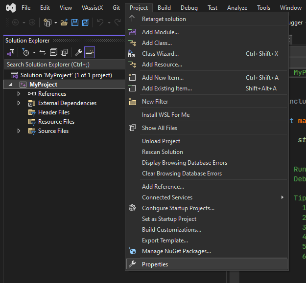
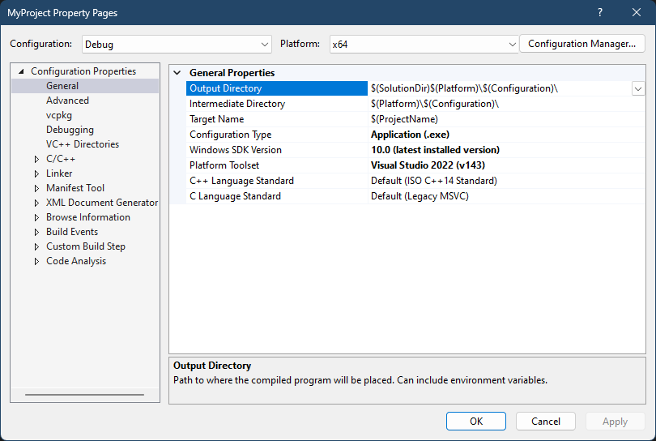

# Project Properties

Project properties are settings that control how your project is built. They are stored in the project file, which has the extension `.vcxproj`. You can edit the project properties by right-clicking on the project in the Solution Explorer and selecting Properties.
It can also be accessed from the Project menu after you have selected which project you wish to edit.

| Solution Explorer | Project Menu |
|-------------------|--------------|
|| |

You should see a window that looks like this:

## Before you start

Before you start editing the project properties, you should make sure that you have the correct configuration selected. You can do this by clicking on the dropdown menu at the top of the window and selecting the configuration you want to edit.
In most cases, you will want to edit the Debug configuration, as this is the configuration that is used when you are debugging your project.
But I have seen alot of people edit just the debug and add libraries to only the debug config so when they try build for release or even x86 they get errors.

For this guide, we will be editing the Debug configuration.

## Properties

There are alot of properties that you can edit, but we will only be covering the most important ones. If I havent listed a property that you can see in the project properties window, then you can safely ignore it. or you can look it up in the [Visual Studio Documentation](https://docs.microsoft.com/en-us/visualstudio/).

### General

| Property | Description |
|----------|-------------|
| Configuration Type | This property determines what type of project you are building. There are three types of projects: Static Library, Dynamic Library, and Application. I might add more info on this later as this can be confusing for new users. |
| Windows SDK Version | This property determines what version of the Windows SDK you are using. You can use the latest version of the Windows SDK by setting this property to "Latest", Typically you dont need to change this property using the latest version is fine. |
| Platform Toolset | This property determines what Toolset you wish to use to build your project. The default toolset is the MSVC toolset, which is the most popular toolset for C++ development on Windows. You can also use the Clang toolset, which is a popular toolset for C++ development on Linux and Mac. (I have found that the clang compiler can tend to give better error messages than the MSVC compiler) |
| C++ and C Language Standard | This property determines what version of the C++ and C standards you are using. The default version is the latest version of the C++ will be C++ 14 and might need to be changed to C++ 17 or C++ 20. Typically you dont need to change the C standard. |

### VCPKG

VCPKG is a package manager for C++ libraries. It is used to install libraries that are not included with Visual Studio. If it was not correctly installed with Visual studiom you can install VCPKG from the [VCPKG GitHub Repository](https://github.com/microsoft/vcpkg).

| Property | Description |
|----------|-------------|
| Use VCPKG Manifest | This property determines whether or not you are using a VCPKG manifest file. A VCPKG manifest file is a file that contains a list of libraries that you want to install with VCPKG. This will mean that when you build your project, VCPKG will automatically install the libraries that you have specified in the manifest file, Useful if you dont wish to manage all your dependancies yourself. |
| Use Static Libraries | This property determines whether or not you are using static libraries. A static library is a library that is linked into your project at compile time. This means that you dont need to distribute the library with your project. This is generally the best option for most projects. |

### C/C++ > General

| Property | Description |
|----------|-------------|
| Additional Include Directories | This property determines what directories you want to include when compiling your project. This is useful if you have header files in a directory that is not in the source folder. Such as a directory that contains header files for a library that you are using. |
| Debug Information Format | This property determines what format you want to use for the debug information. The default format is Program Database (PDB), which is the most popular format for debug information. You can also use Portable Database (PDB), which is a format that is compatible with other compilers. (A common issue you might come across is linking errors when using the Portable Database (PDB) format. This is because the Portable Database (PDB) format is not compatible with the MSVC compiler. If you are having this issue, you can change the Debug Information Format to Program Database (PDB), which is compatible with the MSVC compiler.)
| Support Just My Code Debugging | This property determines whether or not you want to use Just My Code. Just My Code is a feature that allows you to debug your code without having to step through the code of the libraries that you are using. This is useful if you are using a library that you dont have the source code for. |
| Warning Level | This property determines what warning level you want to use. The default warning level is Level 3, which is the most strict warning level. You can also use Level 1, which is the least strict warning level. (I would recommend using the highest warning level possible, as it will help you find bugs in your code) |
| SDL checks | This property determines whether or not you want to use SDL checks. SDL checks are a set of checks that are designed to help you find bugs in your code. They are enabled by default, but you can disable them if you want to. (I would recommend leaving this enabled, as it will help you find bugs in your code) |
| Multi-processor Compilation | This property determines whether or not you want to use multi-processor compilation. Multi-processor compilation is a feature that allows you to compile your project using multiple processors. This can help speed up the compilation process. (I would recommend enabling this, as it will help speed up the compilation process) |

> Note: Multi-processor Compilation is incompatible with Precompiled Headers. If you are using Precompiled Headers, you will need to disable Multi-processor Compilation.

### C/C++ > Preprocessor

| Property | Description |
|----------|-------------|
| Preprocessor Definitions | This property determines what preprocessor definitions you want to use. A preprocessor definition is a macro that is defined before the code is compiled. This is useful if you want to define a macro that is used in multiple source files. (I would recommend using preprocessor definitions sparingly, as they can make your code harder to read and can cause unexpected behavior) |

Thats really the only property I would recommend changing in the Preprocessor, as the rest are not really that important.

### C/C++ > Code Generation

| Property | Description |
|----------|-------------|
| Basic Runtime Checks | This property determines what runtime checks you want to use. Runtime checks are a set of checks that are designed to help you find bugs in your code. They are enabled by default, but you can disable them if you want to. Common runtime checks include stack frame runtime checks, which are designed to help you find stack overflows, and buffer security checks, which are designed to help you find buffer overflows. (I would recommend leaving this enabled, as it will help you find bugs in your code) |
| Runtime Library | This property determines what runtime library you want to use. The default runtime library is Multi-threaded Debug DLL (/MDd), which is the most popular runtime library for C++ development on Windows. You can also use Multi-threaded Debug (/MTd), which is a runtime library that is designed to be used with the MSVC compiler. (I would recommend using the default runtime library, as it is the most popular runtime library for C++ development on Windows) |
| Floating Point Precision | This property determines what floating point precision you want to use. The default precision is precise, which is the most precise floating point precision. You can also use fast, which is the least precise floating point precision. (This setting is really upto the programmer to decide what they want to use, If you are making a game you might want to use fast, but if you are making a program that needs to be precise you might want to use precise) |

### Linker > General

These properties are used to determine what libraries you want to link against. A library is a collection of object files that are linked into your project at compile time. This means that you dont need to distribute the library with your project.

| Property | Description |
|----------|-------------|
| Additional Library Directories | This property determines what directories you want to include when linking your project. This is useful if you have libraries in a directory that is not in the source folder. Such as a directory that contains libraries for a library that you are using. |

I would probably recommend leaving the rest of the properties in the Linker > General section alone, as they are fine left at their default values.

### Linker > Input

| Property | Description |
|----------|-------------|
| Additional Dependencies | This property determines what libraries you want to link against. This is useful if you have libraries that are not in the source folder. Such as a library that you are using. (eg. `SDL2.lib`) |

---

## Common Issues

### Linker Errors

If you are getting linker errors, it is most likely because you are not linking against the correct libraries. You can fix this by adding the correct libraries to the Additional Dependencies property in the Linker > Input section.
Linker errors can be scary due to the amount of text that is outputted, but they are usually easy to fix once you know what you are doing.

### Missing Header Files

If you are getting missing header file errors, it is most likely because you are not including the correct header files. You can fix this by adding the correct header files to the Additional Include Directories property in the C/C++ > General section.

### Symbol Not Found Errors

If you are getting symbol not found errors, it is most likely because you are not linking against the correct libraries. You can fix this by adding the correct libraries to the Additional Dependencies property in the Linker > Input section.

---

## Conclusion

Now you know how to edit the project properties in Visual Studio. You can now start writing code for your project and hopefully not have to worry about the project properties again.

If you have any questions or suggestions, feel free to reach out to me either by [email](mailto: <alexmollard@protonmail.com>) or on [LinkedIn](https://www.linkedin.com/in/alex-mollard/), as im aware how confusing this can be for new users.
