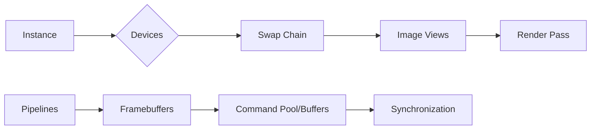

# Devices



Vulkan Devices, comprised of Physical and Logical Devices, serve as the interface to GPUs in a Vulkan application. By identifying suitable Physical Devices, which denote GPUs on your system, we gain access to hardware details like capabilities and memory types. Through a Logical Device, we can command the GPU, manage resources, and execute operations associated with the GPU. Essentially, Vulkan Devices provide the means to interact with the GPU.

---

## Physical Devices

In Vulkan, a Physical Device represents a GPU on your system. It exposes detailed information about the capabilities of the hardware including:

- The types of operations it can support
- The limits (like max image dimension and max memory allocation count) it imposes
- The features it provides, such as texture compression, 64 bit floats, multi-viewport rendering and so forth
- The queue families it offers, determining the kind of commands that queues in this family can execute
- The memory heaps and memory types it contains, giving us insight into the different types of memory that can be allocated

We typically select a suitable Physical Device based on these attributes to ensure it meets the needs of our application. To access a Physical Device and query its properties, we use `vkEnumeratePhysicalDevices` and `vkGetPhysicalDeviceProperties` respectively.

```cpp
uint32_t deviceCount = 0;
vkEnumeratePhysicalDevices(instance, &deviceCount, nullptr);

if (deviceCount == 0) {
    throw std::runtime_error("failed to find GPUs with Vulkan support!");
}

std::vector<VkPhysicalDevice> devices(deviceCount);
vkEnumeratePhysicalDevices(instance, &deviceCount, devices.data());

for (const auto& device : devices) {
    VkPhysicalDeviceProperties deviceProperties;
    vkGetPhysicalDeviceProperties(device, &deviceProperties);

    std::cout << "GPU: " << deviceProperties.deviceName << std::endl;
}
```

This code gets the number of Physical Devices (GPUs), then stores them in a vector. For each device, it queries their properties and prints out their names. After selecting an appropriate Physical Device, we can create a Logical Device for performing operations associated with the GPU.

---

To be written...

Quick Links:

- [Sample Code](#sample-code)
- [Physical Device](#physical-device)
- [Logical Device](#logical-device)
- [Device Extensions](#device-extensions)
- [Device Queues](#device-queues)
- [Device Features](#device-features)
- [Device Properties](#device-properties)
- [Device Memory](#device-memory)
- [Device Limits](#device-limits)
- [Device Groups](#device-groups)
- [Device Creation](#device-creation)
- [Device Destruction](#device-destruction)

## Sample Code
