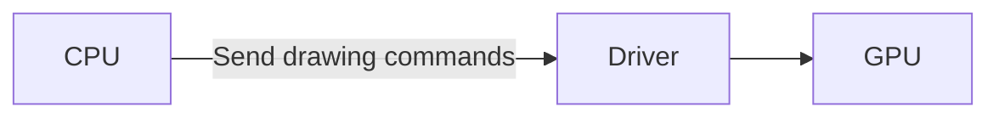
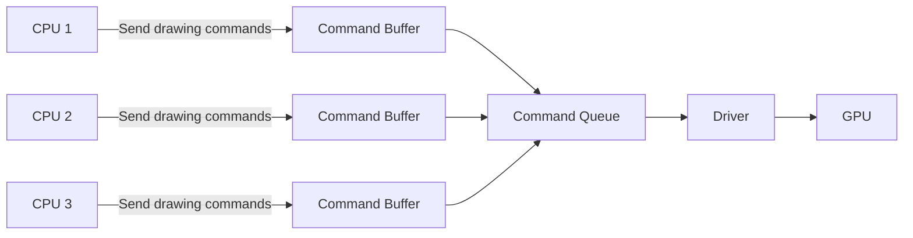

# Vulkan

**Vulkan** is a modern cross-platform graphics and compute API currently under active development by the Khronos consortium. This API is designed from the ground up to provide applications with direct control over GPU acceleration for maximized performance and predictability.

## Key Features of Vulkan:

1. **Cross-Platform Compatibility**: Vulkan APIs offer wide compatibility across multiple platforms, including Windows, Linux, Android, Nintendo switch, and proprietary operating systems.

2. **Improved Performance**: Vulkan reduces CPU usage and improves multi-threading capabilities for significant performance increases in hardware devices.

3. **Explicit Operation**: Vulkan requires developers to provide extensive detail about how they want to utilize the GPU, resulting in fewer driver surprises and consistent frame rates.

4. **Reduced Driver Overhead**: The architecture of Vulkan helps decrease the overhead that can slow down CPUs in games, allowing for improved computational efficiency.

5. **Greater Control**: Vulkan gives software developers greater control over how their programs are run on GPU hardware, enabling them to get more out of less powerful hardware.

---

## OpenGl vs Vulkan

OpenGL, a cross-language, cross-platform application programming interface (API) for rendering 2D and 3D graphics, is traditionally single-threaded. It processes its API calls sequentially on a single core.

Even though you can create multiple threads making OpenGL calls, the system will handle them one at a time. This behavior makes things simpler for both applications and drivers but may not fully utilize the potential of modern multi-core CPUs.

There have been extensions and developments to enable better multi-threading in OpenGL, like AZDO ("Approaching Zero Driver Overhead"). However, these techniques don't automatically distribute separate tasks across multiple cores. Instead, they require explicit support and careful adjustment from the developer.

For comparison, Vulkan, the successor to OpenGL, was designed from the start with parallelism and efficiency as objectives. It handles multi-threading much better than OpenGL. Vulkan allows developers to generate GPU command lists in parallel. This approach makes full use of modern multi-core CPUs.

**Conclusion:**

In conclusion, while OpenGL does permit multi-threaded operations, it is only processed on one thread at a time making it essentially single-threaded. Its extensions do allow for more efficient use of resources, but they require careful optimization by the developer. In comparison, Vulkan, built with parallelism in mind, leverages multi-threading far more effectively.

### Diagrams

Firstly, let's see how OpenGL works:

In OpenGL, the CPU sends drawing commands to the Driver. These commands get accumulated in the driver which is then sent as a Command Queue to be processed by the GPU.

Now, let's look at Vulkan:

In Vulkan, multiple CPUs (CPU 1, CPU 2, CPU 3) concurrently send drawing commands to their individual Command Buffers. These command buffers then send all the commands to a common Command Queue which is then processed by the GPU.

{: .note}
This demonstrates how Vulkan allows for better distribution of workload across multiple cores/CPUs compared to OpenGL which offers a single-threaded approach.

---

# DirectX vs Vulkan

**DirectX**, specifically its graphics component - Direct3D, is a collection of APIs (Application Programming Interfaces) used in Windows for multimedia and video applications, is considered to be single-threaded just like OpenGL. It processes API calls sequentially on a single core.

Although you can create multiple threads executing Direct3D calls, the system will handle them one at a time. This characteristic simplifies both applications and drivers but may not fully leverage the potential of modern multi-core CPUs.

There have been enhancements implemented to facilitate better multi-threading in Direct3D, such as deferred contexts introduced in Direct3D 11. However, these features don't automatically distribute separate tasks across various cores; instead, they require explicit support and meticulous adjustment from the developer.

On the other hand, **Vulkan**, designed with parallelism and efficiency in mind, handles multi-threading significantly better than Direct3D. Vulkan allows developers to generate GPU command lists in parallel, thereby maximising the use of contemporary multi-core CPUs.

**The graphs will be the same as the ones in the OpenGL vs Vulkan section.**

## Conclusion:

To sum it up, while Direct3D does allow for multi-threaded operations, it essentially processes on one thread at a time. Although its enhancements permit a more efficient use of resources, they demand careful optimisation from the developer. In contrast, Vulkan, which was built keeping parallelism in perspective, leverages multi-threading far more effectively.
