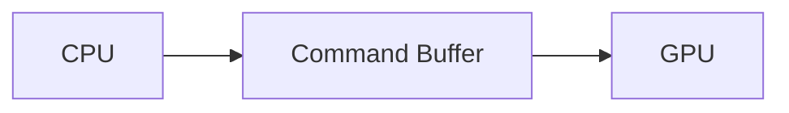
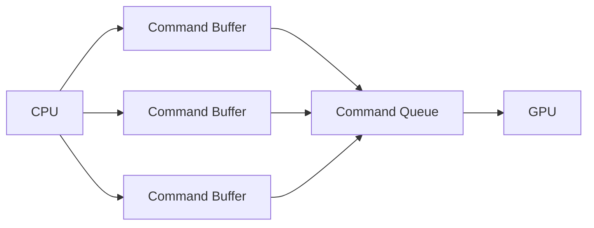

# Vulkan

Vulkan is a low-level graphics API that is designed to give developers more control over the GPU than other graphics APIs such as OpenGL and DirectX 3D.

Vulkan is cross-platform, which means that it can be used on `Windows`, `Linux`, and `Mac OS X`.

Vulkan is also supported on `Android`, `IOS`, and `Nintendo Switch`.

---

## Why Vulkan?

Vulkan is designed to be more efficient than other graphics APIs it achieves this by using a multi-threaded approach to rendering.
If you have experience with OpenGL, you will know that OpenGL is single-threaded, which means that it can only use one CPU core at a time.
Whilst vulkan can only execute one command buffer at a time, it can use multiple CPU cores to build command buffers, which means that it can build command buffers faster than OpenGL.

---

## Why not just use OpenGL?

OpenGL is single-threaded, which means that it can only use one CPU core at a time as seen in the diagram below.

{: .note }
This is a simplified diagram of OpenGL, and it does not show the full structure of OpenGL.
When using OpenGL all of this is handled by the driver, and you do not need to worry about it.

Now that you can see the basic structure of OpenGL, lets take a look at the basic structure of Vulkan.

As you can see, Vulkan can use multiple CPU cores to build command buffers, which means that it can build command buffers faster than OpenGL.

---

## Why not just use DirectX 3D?

DirectX 3D is only supported on `Windows`, which means that it cannot be used on `Linux`, `Mac OS X`, `Android`, `IOS`, or `Nintendo Switch`.

Whilst yes you can use DirectX 3D on `Linux` and `Mac OS X` using `Wine` or `Proton`, it is not officially supported by Microsoft, and it is not guaranteed to work.
